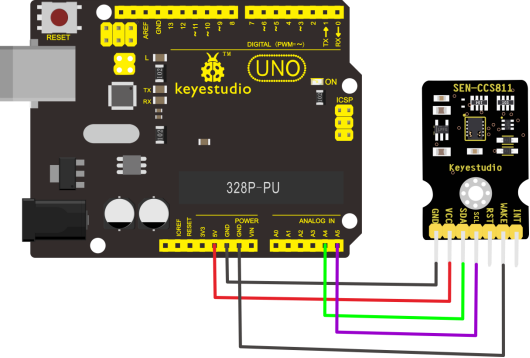
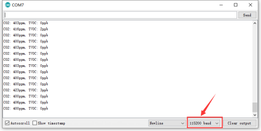
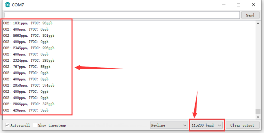

# KS0457 keyestudio CCS811 Carbon Dioxide Air Quality Sensor


## 1. Description

Keyestudio CCS811 carbon dioxide, air quality sensor mainly uses the CCS811 chip. It is an ultra-low-power miniature digital gas sensor that can detect a wide range of volatile organic compounds (TVOCs), including equivalent carbon dioxide (eCO2) and metal oxide (MOX) levels. Equivalent carbon dioxide (eCO2) is measured in the range of 400 to 29206 ppm (parts per million), and various volatile organic compounds (TVOC) ranges from 0 to 32768ppb(parts per billion). 3mm diameter position hole on sensor contributes to fix on the other device.

## 2. Technical Parameters

- Working voltage: DC 5V
- Working current: 30mA
- Maximum power: 60mW
- eCO2 measurement range: 400-29206 ppm
- TVOC measurement range: 0 to 32768ppb
- Interface: 7pin (2.54mm pitch)
- Positioning hole diameter: 3mm
- Dimensions: 30*20mm
- Environmental attributes: ROHS

## 3. PINOUTS

| GND  | ground                                                       |
| ---- | ------------------------------------------------------------ |
| VCC  | Input power（5V）                                            |
| SDA  | I2C data pin                                                 |
| SCL  | I2C clock pin                                                |
| RST  | Reset pin: connect to ground, sensor will automatically reset. |
| WAKE | WAKE pin should connect to ground to communicate with sensor conveniently |
| INT  | This is the interrupt output pin that detects when a new reading is ready or the reading becomes too high or too low. |

## 4. Connection



For the UNO or Nano development board, SDA is connected to A4, SCL to A5.

If it is mega2560 development board, connect SDA to D20, SCL to D21

## 5. Test Code

Download Resource:  [Resource](./Resource.7z)

```c
#include <CCS811.h>

//CCS811 sensor(&Wire, /*IIC_ADDRESS=*/0x5A);
CCS811 sensor;

void setup(void)
{
    Serial.begin(115200);
    /*Wait for the chip to be initialized completely, and then exit*/
    while(sensor.begin() != 0)
    {
        Serial.println("failed to init chip, please check if the chip connection is fine");
        delay(1000);
    }
    /**
     * @brief Set measurement cycle
     * @param cycle:in typedef enum{
     *                  eClosed,      //Idle (Measurements are disabled in this mode)
     *                  eCycle_1s,    //Constant power mode, IAQ measurement every second
     *                  eCycle_10s,   //Pulse heating mode IAQ measurement every 10 seconds
     *                  eCycle_60s,   //Low power pulse heating mode IAQ measurement every 60 seconds
     *                  eCycle_250ms  //Constant power mode, sensor measurement every 250ms
     *                  }eCycle_t;
     */
    sensor.setMeasCycle(sensor.eCycle_250ms);
}

void loop() 
{
    delay(1000);
    if(sensor.checkDataReady() == true)
    {
        Serial.print("CO2: ");
        Serial.print(sensor.getCO2PPM());
        Serial.print("ppm, TVOC: ");
        Serial.print(sensor.getTVOCPPB());
        Serial.println("ppb") 
    } 
    else 
    {
        Serial.println("Data is not ready!");
    }
    /*!
     * @brief Set baseline
     * @param get from getBaseline.ino
     */
    sensor.writeBaseLine(0x847B);
    //delay cannot be less than measurement cycle
    //delay(1000);
}
```

## 6. Test Result

Done uploading the code, open the serial monitor and set the baud rate to 115200. The data will be displayed on serial monitor. It may not correct at the beginning, just wait for a few minutes(up to 20min)until the data is stable.



When a person exhales to the sensor, , the data changes obviously, as shown below:


